# Documentación CRUD con cURL 📚
Este apartado describe y demuestra el funcionamiento de las operaciones CRUD implementadas en el script `crud-curl.js`, que interactúan con la API de estudiantes mediante comandos cURL.


## ¿Qué es cURL?
Es una herramienta de línea de comandos que permite enviar solicitudes HTTP a servidores. Se utiliza para probar endpoints de una API, permitiendo ver las respuestas reales del servidor y verificar que las operaciones funcionan correctamente.

## Índice de operaciones
1. CREATE
2. READ ALL
3. READ BY ID
4. UPDATE
5. PATCH
6. DELETE


## 1. CREATE (Crear estudiante)
Crea un nuevo estudiante en la base de datos.

### Comando cURL
```bash
curl -i -X POST http://localhost:4000/students \
    -H "Content-Type: application/json" \
    -d '{"id":10,"name":"Nayara Bastida","email":"nayara@gmail.com","enrollmentDate":"2020-10-01","active":true,"level":"beginner"}'
```

### Explicación detallada de cada parte
#### Qué hace cada flag
- **i** → Incluye en la salida los headers de la respuesta HTTP junto con el cuerpo body, hace que la respuesta contenga más información relevante.
- **X POST** → Indica el método HTTP que se usa (POST).
- **http://localhost:4000/students** → Es la URL del endpoint al que se envía la solicitud.
- **H "Content-Type: application/json"** → Header que indica que el cuerpo que enviamos está en formato JSON.
- **d '{...}'** → Datos del estudiante que queremos crear.

#### Por qué se usa ese método HTTP
Se usa el método **POST** para enviar datos al servidor y crear un nuevo recurso (estudiante) en la base de datos.

#### Qué headers se envían y porque
Enviamos el header `Content-Type: application/json` para que el servidor sepa que la petición está en formato JSON.

### Respuesta HTTP real obtenida (headers + body)
La siguiente imagen muestra la respuesta completa tras ejecutar el comando. Se observan los headers y el body devuelto el crear el estudiante.

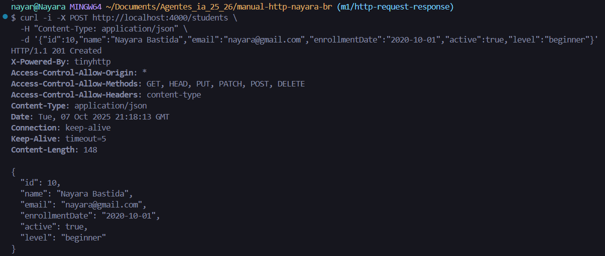

### Explicación del código de estado HTTP recibido
`HTTP/1.1 201 Created` → Indica que el recurso fue creado correctamente en el servidor y devuelve los datos del nuevo estudiante como confirmación.


## 2. READ ALL (Leer todos los estudiantes)
Obtiene la lista completa de estudiantes.

### Comando cURL
```bash
curl -i -X GET http://localhost:4000/students
```

### Explicación detallada de cada parte
#### Qué hace cada flag
- **i** → Incluye los headers y el body de la respuesta.
- **X GET** → Indica el método HTTP que se usa (GET).
- **http://localhost:4000/students** → Es la URL del endpoint al que se envía la solicitud.

#### Por qué se usa ese método HTTP
Se usa el método **GET** para obtener información sin cambiar nada en el servidor.

#### Qué headers se envían y porque
No se envían headers ya que para esta petición no se envían datos.

### Respuesta HTTP real obtenida (headers + body)
La siguiente imagen muestra la respuesta tras ejecutar el comando. Se observan los headers y el body que contiene todos los estudiantes registrados.

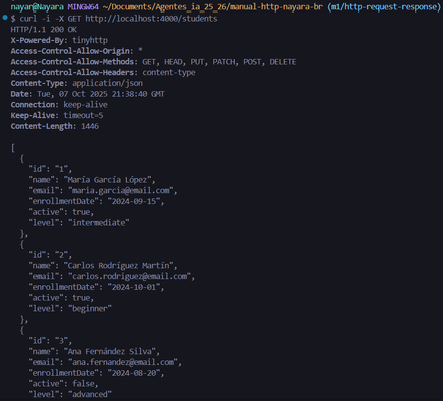

### Explicación del código de estado HTTP recibido
`HTTP/1.1 200 OK` → Indica que la petición fue correcta y se mostró la información solicitada correctamente.


## 3. READ BY ID (Leer estudiante mediante ID)
Obtiene los datos de un estudiante específico usando su ID.

### Comando cURL
```bash
curl -i -X GET http://localhost:4000/students/10
```

### Explicación detallada de cada parte
#### Qué hace cada flag
- **i** → Incluye los headers y el body de la respuesta.
- **X GET** → Indica el método HTTP que se usa (GET).
- **http://localhost:4000/students/10** → Es la URL del endpoint al que se envía la solicitud, usamos /10 ya que es el ID del estudiante al que queremos acceder.

#### Por qué se usa ese método HTTP
Se usa el método **GET** para obtener información de un recurso sin cambiar modificar el servidor.

#### Qué headers se envían y porque
No se envían headers porque en este caso solo queremos consultar información.

### Respuesta HTTP real obtenida (headers + body)
La siguiente imagen muestra la respuesta completa tras ejecutar el comando. Se observan los headers y el body que contiene el estudiante indicado.

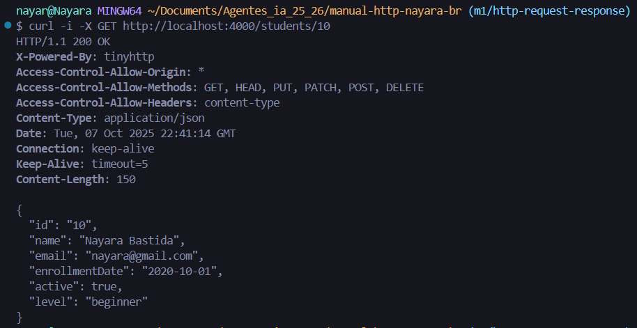

### Explicación del código de estado HTTP recibido
`HTTP/1.1 200 OK` → Indica que todo fue bien y se mostró la información del estudiante solicitado.


## 4. UPDATE (Actualizar estudiante completo)
Actualiza completamente los datos de un estudiante.

### Comando cURL
```bash
curl -i -X PUT http://localhost:4000/students/10 \
    -H "Content-Type: application/json" \
    -d '{"id":10, "name":"Nayara Bastida", "email":"nayara_cambiado@gmail.com", "enrollmentDate":"2020-20-02", "active":true, "level":"intermediate"}'
```

### Explicación detallada de cada parte
#### Qué hace cada flag
- **i** → Incluye los headers y el body de la respuesta.
- **X PUT** → Indica el método HTTP que se usa (PUT).
- **http://localhost:4000/students/10** → Es la URL endpoint del estudiante con ID 10.
- **H "Content-Type: application/json"** → Header que indica que el cuerpo que enviamos está en formato JSON.
- **d '{...}'** → Datos obligatorios que se envían, incluso si no han cambiado.

#### Por qué se usa ese método HTTP
Se usa el método **PUT** ya que remplaza el recurso por completo, es el más útil cuando se quieren actualizar todos los datos.

#### Qué headers se envían y porque
Enviamos el header `Content-Type: application/json` para que el servidor sepa que la petición está en formato JSON.

### Respuesta HTTP real obtenida (headers + body)
La siguiente imagen muestra la respuesta completa tras ejecutar el comando. Se observan los headers y el body que contiene el estudiante actualizado completamente.

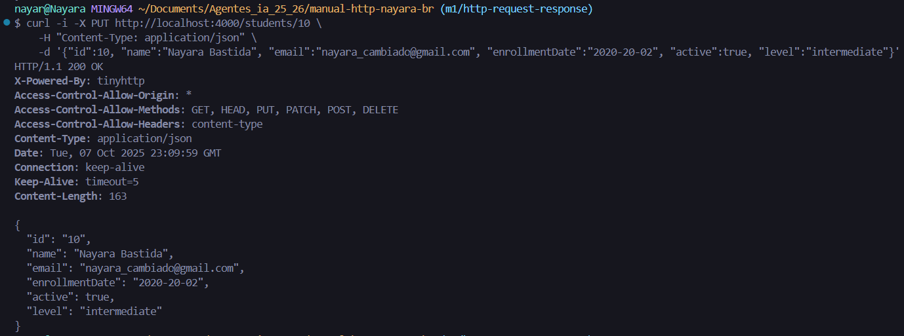

### Explicación del código de estado HTTP recibido
`HTTP/1.1 200 OK` → Indica que todo fue bien y se mostró la información del estudiante actualizada.


## 5. PATCH (Actualizar estudiante parcialmente)
Actualiza parcialmente los datos de un estudiante, cambiando solo algunos campos.

### Comando cURL
```bash
curl -i -X PATCH http://localhost:4000/students/10 \
    -H "Content-Type: application/json" \
    -d '{"active":false}'
```

### Explicación detallada de cada parte
#### Qué hace cada flag
- **i** → Incluye los headers y el body de la respuesta.
- **X PATCH** → Indica el método HTTP que se usa (PATCH).
- **http://localhost:4000/students/10** → Es la URL endpoint del estudiante con ID 10.
- **H "Content-Type: application/json"** → Header que indica que el cuerpo que enviamos está en formato JSON.
- **d '{...}'** → Datos del campo que queremos actualizar.

#### Por qué se usa ese método HTTP
Se usa el método **PATCH** ya que no queremos cambiar todos los datos del recurso, es el más útil cuando se quieren hacer cambios puntuales.

#### Qué headers se envían y porque
Enviamos el header `Content-Type: application/json` para que el servidor sepa que la petición está en formato JSON.

### Respuesta HTTP real obtenida (headers + body)
La siguiente imagen muestra la respuesta completa tras ejecutar el comando. Se observan los headers y el body que contiene el estudiante con el campo actualizado.

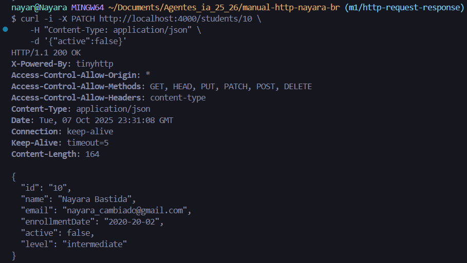

### Explicación del código de estado HTTP recibido
`HTTP/1.1 200 OK` → Indica que todo fue bien y se mostró la información del estudiante actualizada con `active:false`.


## 6. DELETE (Eliminar estudiante)
Elimina a un estudiante de la base de datos mediante su ID.

### Comando cURL
```bash
curl -i -X DELETE http://localhost:4000/students/10
```

### Explicación detallada de cada parte
#### Qué hace cada flag
- **i** → Incluye los headers y el body de la respuesta.
- **X DELETE** → Indica el método HTTP que se usa (DELETE).
- **http://localhost:4000/students/10** → Es la URL del endpoint al que se envía la solicitud, usamos /10 ya que es el ID del estudiante al que queremos acceder.

#### Por qué se usa ese método HTTP
Se usa el método **DELETE** para eliminar un recurso del servidor.

#### Qué headers se envían y porque
No se envían headers ya que no es necesario en este caso.

### Respuesta HTTP real obtenida (headers + body)
La siguiente imagen muestra la respuesta completa tras ejecutar el comando. Se observan los headers y el body que contiene el estudiante eliminado como confirmación.

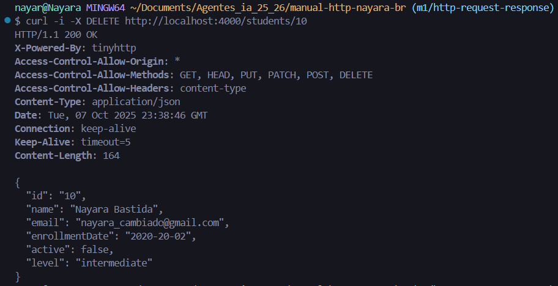

### Explicación del código de estado HTTP recibido
`HTTP/1.1 200 OK` → Indica que todo fue bien y se mostró la información del estudiante eliminado.


---


# Thunder Client – Pruebas CRUD con la API de Estudiantes ⚡
Este apartado describe cómo probar las operaciones CRUD sobre la API de estudiantes usando Thunder Client. 

## ¿Qué es Thunder Client?
Es una extensión para VS Code que permite realizar solicitudes HTTP sin salir del editor. Es muy útil cuando queremos probar endpoints de una API de manera visual y sencilla.

### 1. Instalar Thunder Client
1. Abre VS Code.
2. Ve a la pestaña **Extensiones** (Icono de cuadrados).
3. Busca **"Thunder Client"** e instálalo.

### 2. Abrir Thunder Client
1. Haz clic en el ícono de Thunder Client (Tiene forma de rayo) que aparece en la barra lateral.
2. Presiona **"New Request"** para crear una nueva solicitud HTTP.

### 3. Realizar una petición
Completa los siguientes campos:

- **Método**: Selecciona `GET`, `POST`, `PUT`, `PATCH` o `DELETE`.
- **URL**: Escribe el endpoint completo. Por ejemplo → `http://localhost:4000/students`.
- **Headers**:
    - Haz clic en la pestaña **"Headers"**.
    - Agrega el header `Content-Type: application/json` (Solo si vas a enviar datos en el body).
- **Body** (Solo para  `POST`, `PUT` o `PATCH`):
    - Ve a la pestaña **"Body"**, selecciona formato `JSON`.
    - Escribe el contenido que quieras enviar. Por ejemplo → Los datos de un estudiante.

### 4. Ver la respuesta
Haz clic en el botón **"Send"**. Verás:

- El **status** de la respuesta (200 OK, 201 Created, 404 Not Found, etc).
- El **body** de la respuesta en formato JSON.
- Los **headers** de la respuesta.

Si ejecutas tu API con JSON Server, recuerda iniciar el servidor primero:

```bash
json-server --watch db.json --port 4000
```


## Configuración previa
Para trabajar con nuestra API local, se ha utilizado la siguiente configuración:

- **Base URL**: `http://localhost`
- **Puerto**: `4000`
- **Endpoint principal**: `/students`
- **Otros recursos disponibles**: `/courses`, `/enrollments`

Ejemplo de endpoint completo:
```bash
http://localhost:4000/students
```

> **Nota**⚠️: La versión gratuita de Thunder Client no soporta colecciones o entornos de variables, por lo que cada solicitud se ha realizado de manera manual, insertando la URL y el body correspondiente


## Índice de peticiones
1. CREATE (Crear estudiante)
2. READ ALL (Leer todos los estudiantes)
3. READ BY ID (Leer estudiante por ID)
4. UPDATE (Actualizar estudiante)
5. PATCH (Actualizar estudiante parcialmente)
6. DELETE (Eliminar estudiante)


## 1. CREATE (Crear estudiante)
- **Request**
En esta captura se muestra la petición `POST` para crear un nuevo estudiante. Incluyendo la `URL` del endpoint `(http://localhost:4000/students)`, el `método` seleccionado y el `body` en formato `JSON` con los datos del estudiante que queremos crear.
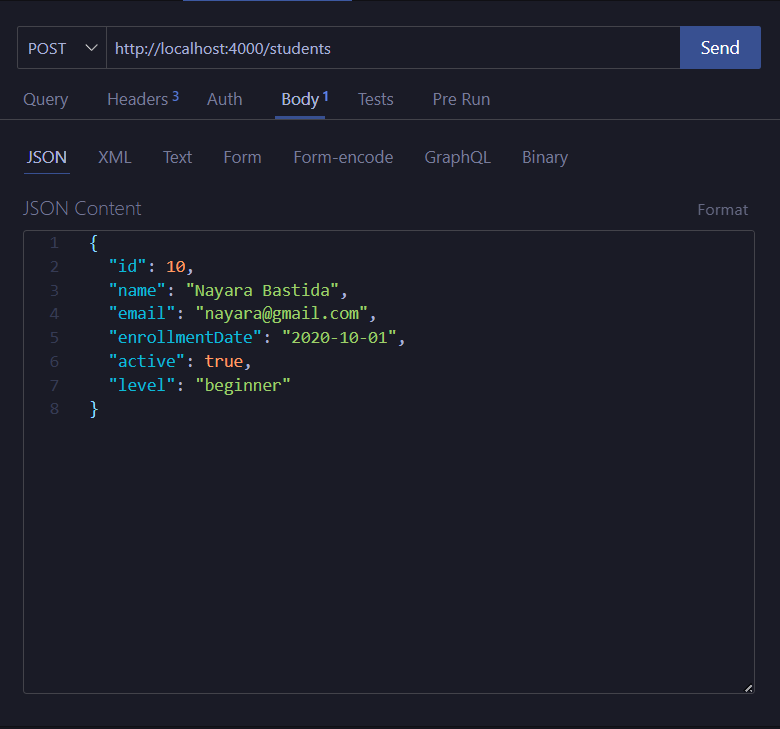

- **Request Headers**
En esta captura se muestra la pestaña `Headers` donde se define el valor `Content-Type: application/json`, que informa al servidor del formato de la solicitud.
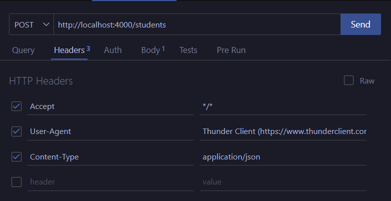

- **Response**
Esta captura muestra la respuesta del servidor tras crear al estudiante. Podemos ver el status `201 Created` junto con el `body` devuelto que son los datos del nuevo estudiante como confirmación.
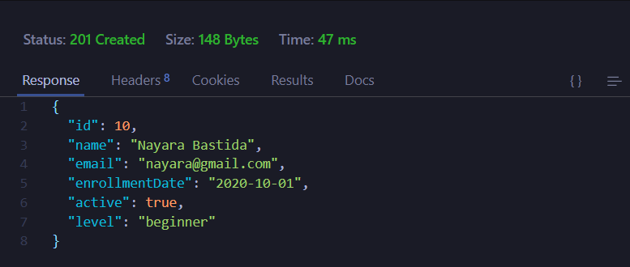

- **Response Headers**
Esta captura muestra la pestaña `Headers` de la respuesta. Podemos observar los encabezados enviados por el servidor, incluyendo `Content-Type: application/json` y otros headers como la fecha, longitud del contenido, etc.
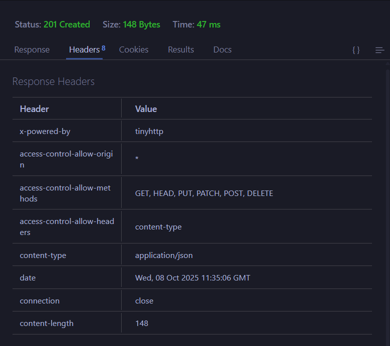


## 2. READ ALL (Leer todos los estudiantes)
- **Request & Response**
En esta captura se muestra la petición `GET` para obtener la lista completa de estudiantes. Se incluye la `URL` del endpoint `(http://localhost:4000/students)` y el `método` seleccionado. También se muestra la respuesta del servidor, donde se observa el status `200 OK` y el `body` con el listado de todos los estudiantes en formato JSON.
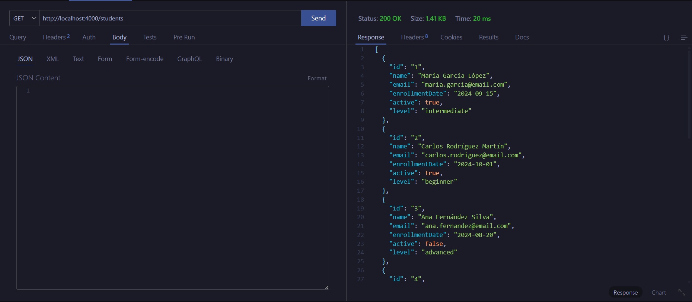

- **Request Headers**
Como es una petición `GET`, no se agregan headers adicionales.

- **Response Headers**
Aquí se visualizan los encabezados devueltos por el servidor.
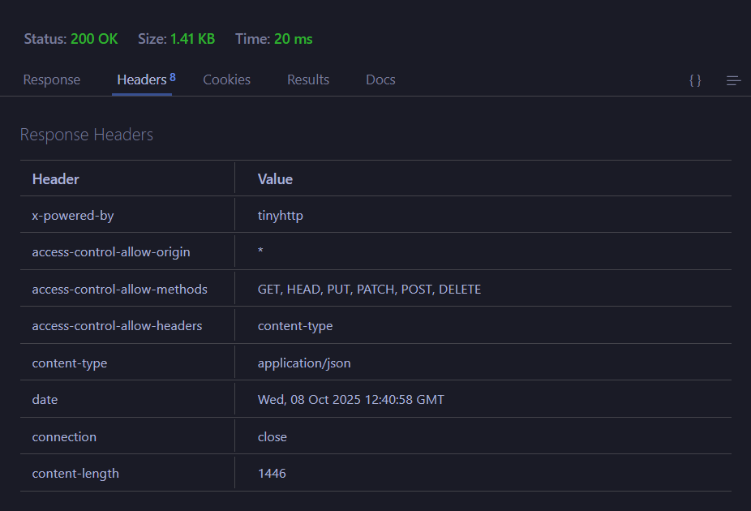


## 3. READ BY ID (Leer estudiante mediante ID)
- **Request & Response**
Petición `GET` para obtener un estudiante específico. Usando la `URL` del endpoint con el ID `(http://localhost:4000/students/10)` y el `método` seleccionado. También vemos la respuesta del servidor con status `200 OK` y `body` con el estudiante solicitado.
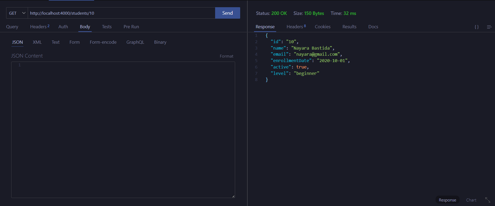

- **Request Headers**
No se incluyen headers ya que no es necesario.

- **Response Headers**
Encabezados recibidos en la respuesta.
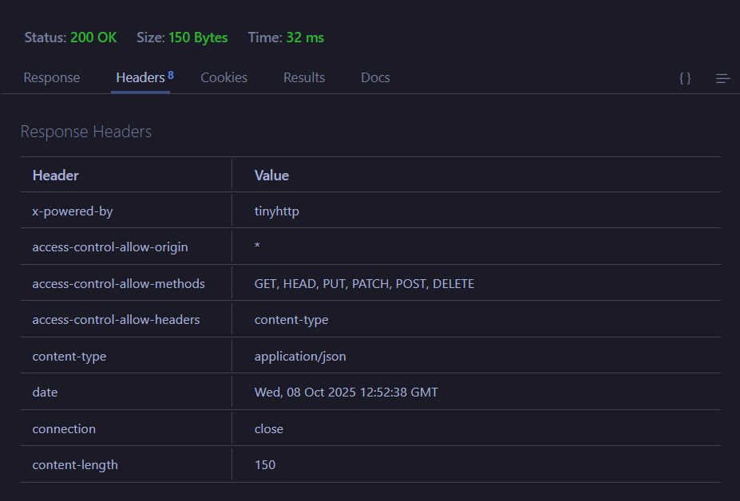


## 4. UPDATE (Actualizar estudiante completo)
- **Request**
Petición `PUT` para actualizar completamente los datos del estudiante con ID 10. Se muestra la `URL`, el `método` y el `body` que contiene todos los campos obligatorios del estudiante, aunque no vayan a cambiar.
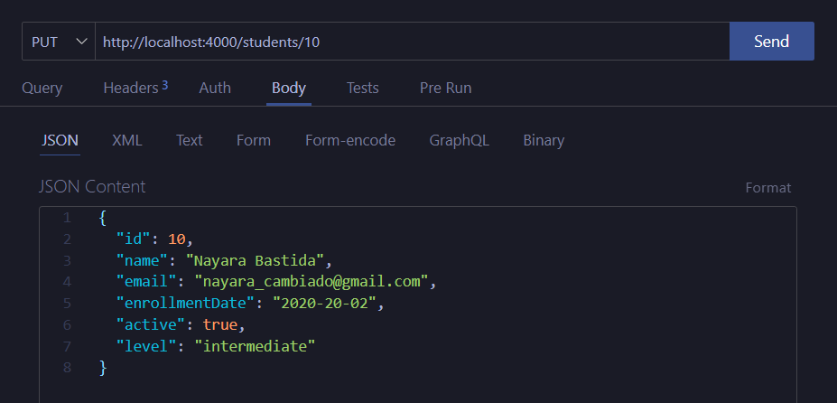

- **Request Headers**
Pestaña `Headers` donde se muestra `Content-Type: application/json` para indicar el formato del body enviado.
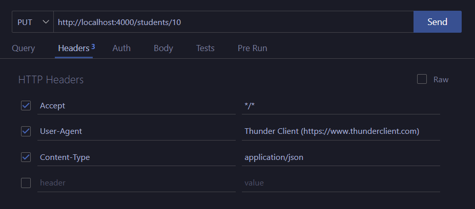

- **Response**
Respuesta con status `200 OK` y `body` devuelto con el estudiante actualizado.
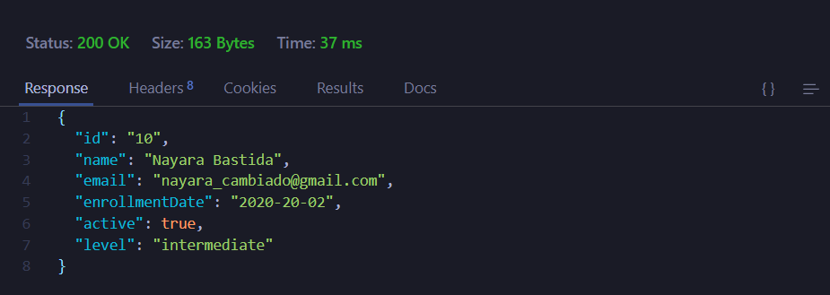

- **Response Headers**
Encabezados recibidos en la respuesta.


## 5. PATCH (Actualizar estudiante parcialmente)
- **Request**
Petición `PATCH` para modificar parcialmente el estudiante con ID 10. En este caso solo vamos a actualizar el campo `active`. Se muestra la `URL`, el `método` y el `body`
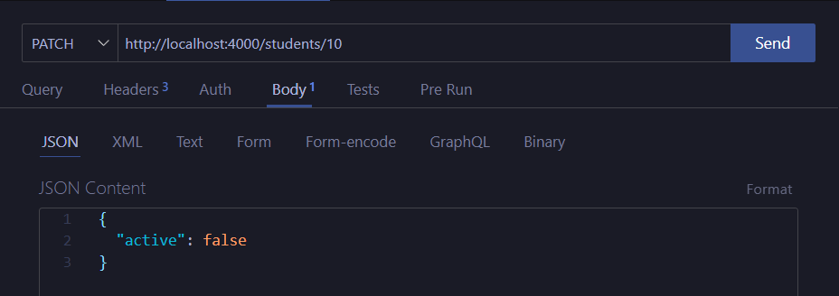

- **Request Headers**
Se muestra el header `Content-Type: application/json` para el body JSON enviado.
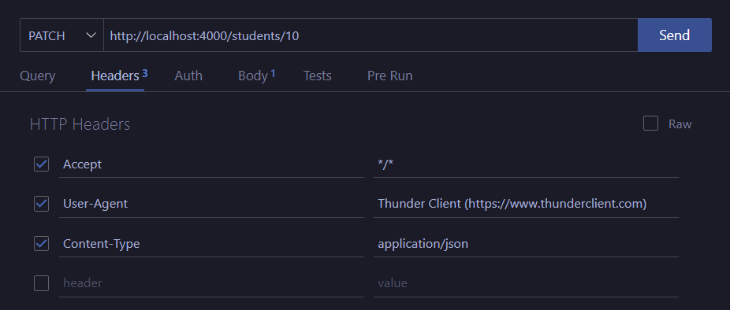

- **Response**
Status `200 OK` y `body` con los datos del estudiante con el campo modificado.
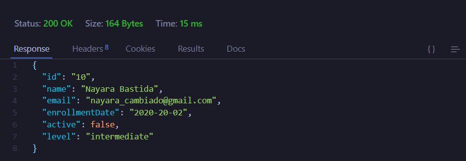

- **Response Headers**
Headers recibidos en la respuesta.
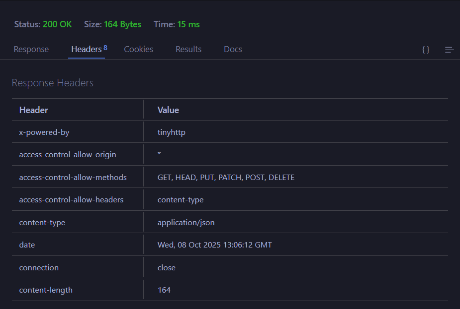


## 6. DELETE (Eliminar estudiante)
- **Request & Response**
Petición `DELETE` para eliminar al estudiante con ID 10, mostrando la `URL` y el `método` usado. También podemos ver la respuesta del servidor con status `200 OK` y `body` con el estudiante eliminado devuelto como confirmación.
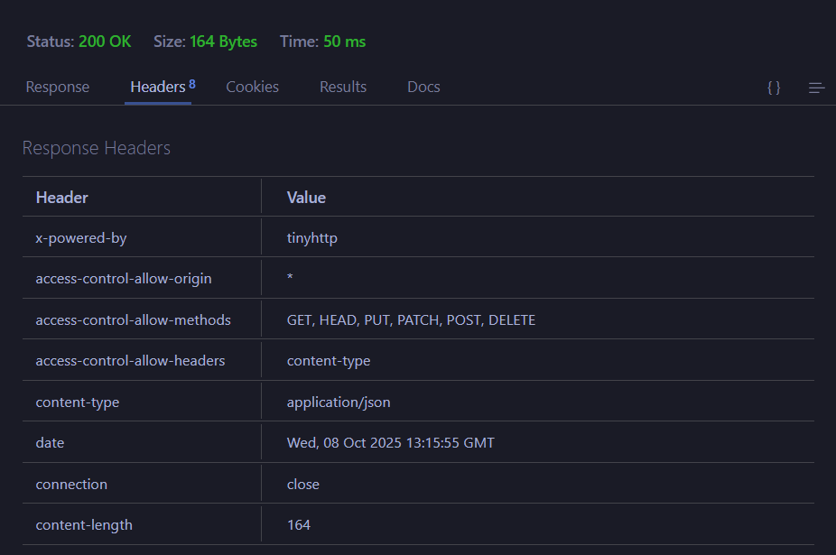

- **Request Headers**
No se necesitan headers para esta petición.

- **Response Headers**
Headers recibidos en la respuesta.
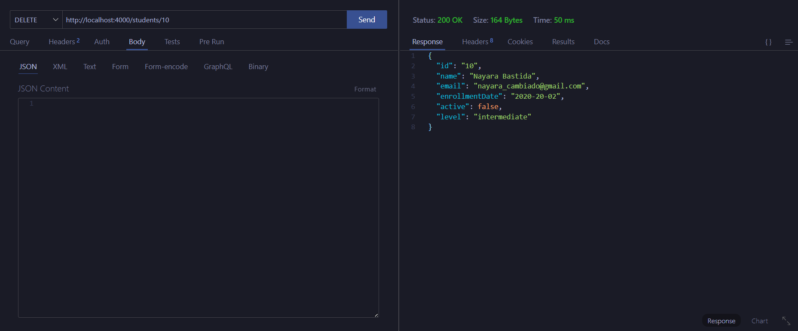


---


# REST API con REST Client ⚡
Este apartado describe las peticiones realizadas con **REST Client** para interactuar con la API de estudiantes, utilizando las operaciones CRUD implementadas.


## Índice de peticiones
1. CREATE - Crear estudiante
2. READ - Leer todos los estudiantes
3. READ - Leer estudiante por ID
4. READ - Filtrar estudiantes activos
5. READ - Filtrar por nivel
6. UPDATE - Actualizar estudiante completo
7. PATCH - Actualizar campo específico
8. DELETE - Eliminar estudiante


## 1. CREATE - Crear estudiante
Crea un nuevo estudiante en la base de datos.

### Comando REST Client
```bash
POST {{apiUrl}}
Content-Type: application/json
Accept: application/json

{
    "id": 15,
    "name": "Adrián Trujillo",
    "email": "adrian@gmail.com",
    "enrollmentDate": "2023-08-01",
    "active": true,
    "level": "beginner"
}
```

### Resultado
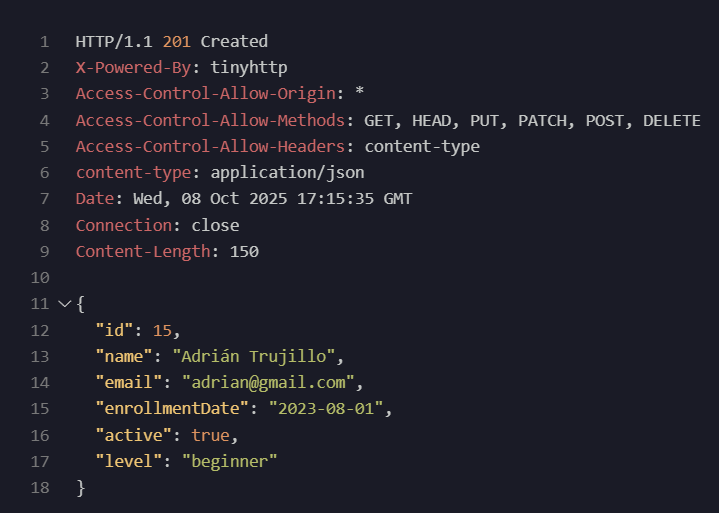


## 2. READ ALL - Leer todos los estudiantes
Obtiene todos los estudiantes registrados en la base de datos.

### Comando REST Client
```bash
GET {{apiUrl}}
Accept: application/json
```

### Resultado
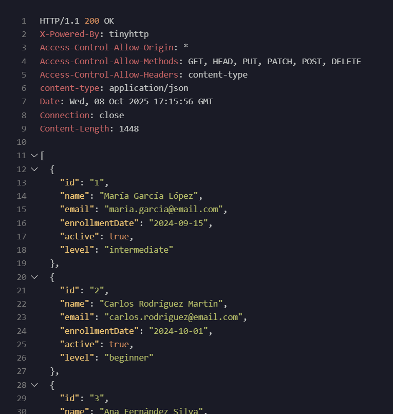


## 3. READ BY ID - Leer estudiante por ID
Obtiene los datos de un estudiante específico mediante su ID.

### Comando REST Client
```bash
GET {{apiUrl}}/15
Accept: application/json
```

### Resultado
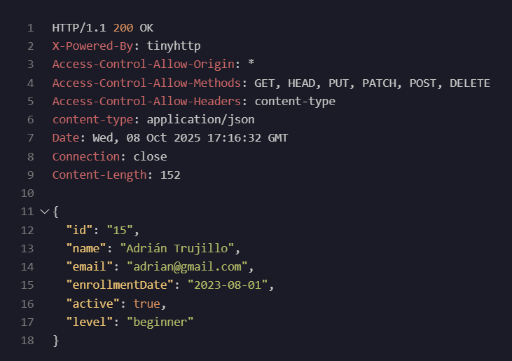


## 4. READ Active - Filtrar estudiantes activos
Obtiene los estudiantes cuyo estado active sea true.

### Comando REST Client
```bash
GET {{apiUrl}}?active=true
Accept: application/json
```

### Resultado
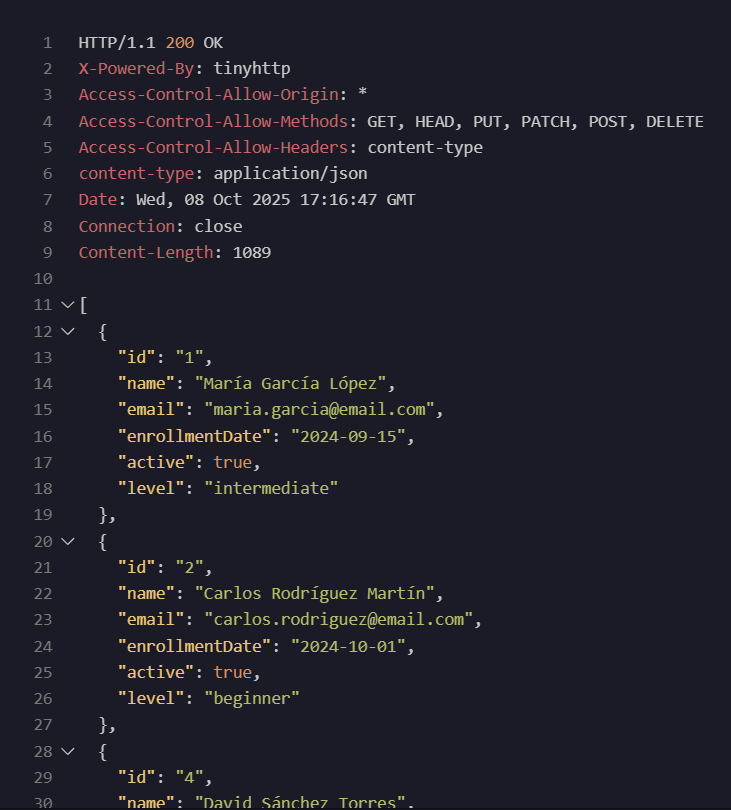


## 5. READ Level - Filtrar por nivel
Obtiene los estudiantes cuyo nivel es el que especifíque la consulta.

### Comando REST Client
```bash
GET {{apiUrl}}?level=intermediate
Accept: application/json
```

### Resultado
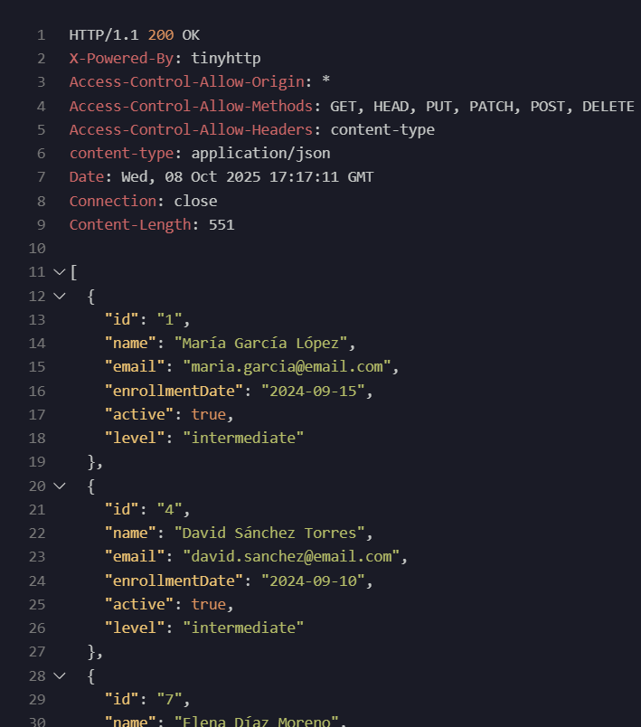


## 6. UPDATE - Actualizar estudiante completo
Actualiza todos los datos de un estudiantes existente, se reemplazan los actuales por los nuevos datos proporcionados.

### Comando REST Client
```bash
PUT {{apiUrl}}/15
Content-Type: application/json
Accept: application/json

{
    "id": 15,
    "name": "Adrián Trujillo",
    "email": "adrian_cambio@gmail.com",
    "enrollmentDate": "2023-08-01",
    "active": true,
    "level": "intermediate"
}
```

### Resultado
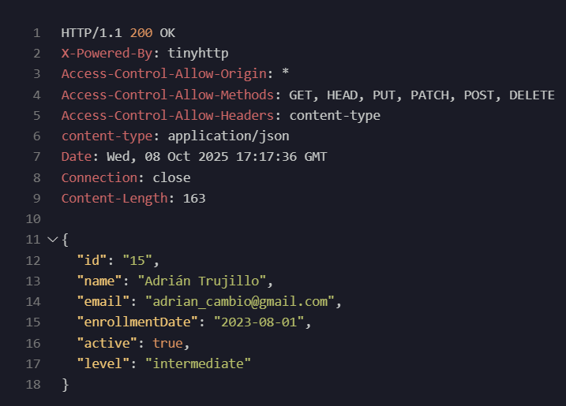


## 7. PATCH - Actualizar campo específico
Actualiza un campo específico de un estudiante, sin cambiar los otros datos.

### Comando REST Client
```bash
PATCH {{apiUrl}}/15
Content-Type: application/json
Accept: application/json

{
    "active": false
}
```

### Resultado
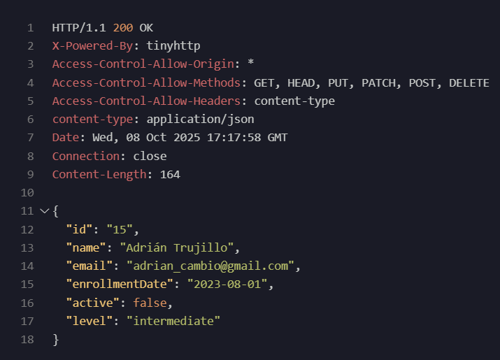


## 8. DELETE - Eliminar estudiante
Elimina a un estudiante mediante su ID

### Comando REST Client
```bash
DELETE {{apiUrl}}/15
Accept: application/json
```

### Resultado
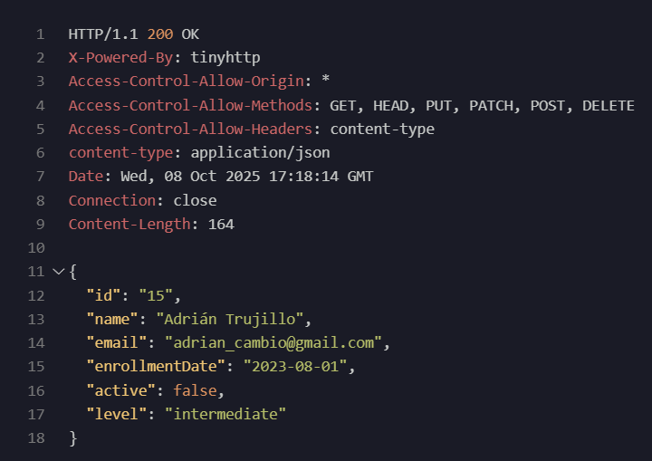